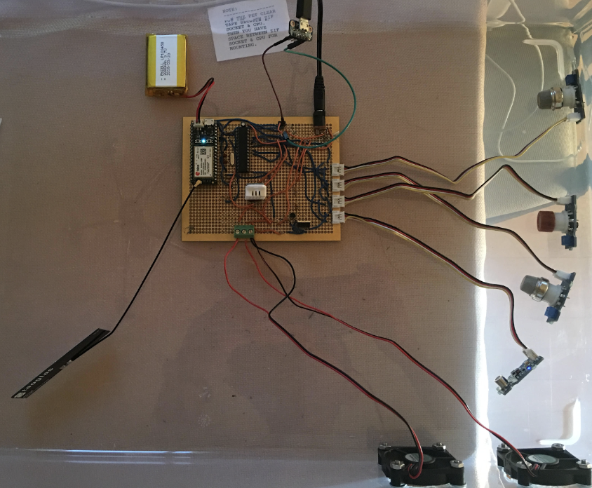

# Air Pollution Monitor V1 Design 
Hey there! My name is Sanjeev. This is a page describing my air pollution monitor design (Version 1) that I finished building in the winter of 2018. Currently working on Version 2, which features more accurate sensors and the ability to group multiple monitors together for data analysis. 

## Purpose 
The purpose of this project was to build an internet-connected device that quantifies and logs data related to the concentrations of various air pollutants. This data can then be analyzed using statistical analysis to isolate potential contributing factors to localized air pollution. This device, coupled with analytics, comprise the “system” in reference.  

## Workings
Due to the usage of the device in remote areas, the device connects to the internet using a cellular connection. A Particle Electron microcontroller was ideal for use in the device, as it can easily be interfaced with a 3G cellular connection. Furthermore, the Particle Electron has the added advantage that it can be programmed remotely. This enables functionality and debugging software updates to be conveniently implemented. An Atmel ATmega 328 was used as a secondary microcontroller that controls all inputs (including the pollutant sensors) and outputs within the device. Due to future software updates, the device’s flexibility was prioritized. This entailed interfacing the Atmel ATmega 328 microcontroller to the Particle Electron in such a manner that the Particle Electron has complete control over the ATmega’s instruction execution. Data is sent between the Electron and ATmega 328 using serial UART protocols. This data is comprised of commands, in the form of ASCII characters, that notify the ATmega to read sensors and/or change the state of the fans (see bottom of paragraph for more information about the fans). The device’s enclosure is weatherproof to protect it from rain. Additionally, the device’s enclosure was made so that it does not interfere with the Particle Electron’s cellular antenna. This eliminated metal as a potential material for the enclosure and made plastic the ideal choice. Care was taken to prevent the plastic enclosure from interfering with cellular data transfer, which entailed considerable complexity in the design (considering the fact that the enclosure must still retain its weatherproof functionality). A subsystem was implemented to make air flow over the sensors. This subsystem was made using multipurpose, 12 volt motors with fan attachments. 

The final product was programmed to measure Volatile Organic Compounds (VOC), Nitrogen Dioxide (NO2), Carbon Monoxide (CO), Ammonia (NH3), concentration of particulate matter less than 1.0 μm in diameter (PM1.0Mass), concentration of particulate matter less than 2.5 μm in diameter (PM2.5Mass), concentration of particulate matter less than 10 μm in diameter (PM10Mass), number of particles with diameter beyond 0.3 μm (PM0.3Count), number of particles with diameter beyond 0.5 μm (PM0.5Count), number of particles with diameter beyond 1.0 μm (PM1.0Count), number of particles with diameter beyond 2.5 μm (PM2.5Count). 

## Prototypes
Two prototypes were made. The first, made using breadboards, was used to develop the Electron - ATmega328 communication method. Functional code was also made for this prototype. The second prototype was made using a perfboard and solder, and it also had new firmware. The hardware design comprising the second prototype was translated directly into the final product (see page 3 for final product). 



## Components of Final Product
1. Custom PCB (see “PCB” on page 4 for more info)
2. Grove Multichannel Gas Sensor
3. Grove Air Quality Sensor V1.3
4. Plantower PMS5003 Digital Universal Particle Concentration Sensor 
5. DHT22 Temperature and Humidity Sensor
6. ATmega328p microcontroller
7. Particle Electron Microcontroller with 3G Particle SIM card
8. taoglas PC104 Penta Band Cellular Antenna
9. Waterproof storage container
10. Electrical Tape 
11. Hot Glue
12. Plastic Glue
13. Plastic Cups (x4)
14. Wires
15. Power Brick (Battery with 12V and 5V outputs)
16. 3.7V DC 1800 mAh LiPo Battery
17. 16 MHz crystal oscillator
18. Micro USB port 
19. 5.5mm DC Barrel Jack
20. Perfboard
21. SUNON DC12V 0.9W fans (x2)
22. 1k Ω resistors (x4) 
23. 10k Ω resistor 
24. 4.7kΩ resistor 
25. 470 Ω resistor (x2)
26. 22pf ceramic capacitors (x2)
27. 10uf electrolytic capacitor 
28. 2N3904 NPN Transistor
29. IRF530 N-Channel MOSFET 

## Notes Regarding Final Product
The multiple MQ gas sensors used in the prototypes were replaced by a grove multichannel gas sensor, which measured the main health-affecting air pollutants: NO2, CO, and NH3 (though it has the capability to measure other gases as well). The PM sensor (‘Particle Sensor’ in the schematic) was used to measure PM0.3, PM0.5, PM1.0, PM 2.5, PM10. Adafruit PM sensor code was modified and used to interface with the PM sensor. See end of “Workings” on page 1 for more information about these measures. 

## PCB
A custom, two-layer, PCB was designed to house all electrical components and was sent to a factory for manufacturing. 

## Serial Data Transfer Hardware and Method
As seen in the schematic above, there is a voltage divider in between the ATmega328’s TX pin and the Electron’s RX pin. This enables communication between the 5V ATmega328 and the 3.3V Particle Electron. The resistors in the voltage divider were chosen to precisely generate a 3.3V output when there is 5V on the left node of R5 (see schematic). This only happens when TX of the ATmega328 goes high. Because the ATmega328 detects 3.3V as a logical high, the TX of the Electron can be directly connected to the RX of the ATmega328. This method will only work reliably at low data transfer rates (baud rates). For this reason, a baud rate of 9600 bits/second was used. The simplest, and most reliable, method of data transfer from the Arduino to the Electron was to convert the floats and integers outputted by the various sensors to strings. These strings were then concatenated and converted into a char array. This char array was sent to the Particle Electron using Serial.write(). Upon receiving any data on its RX line, the Electron sends the data to particle.io servers.

## Usage
Multiple device trials were used to gauge the air pollution, in order to quantify the effect of a local quarry on pollutant concentrations. This was the original purpose of the system. The data resulting from this study is currently being processed at the time of writing. Another use case of the system was quantifying air pollutants in the Bay Area during the November wildfires in Northern California. This data was compared to a set of control data taken when there were no wildfires. All data is sent to Particle.io servers using the Particle.publish() command. Every time Particle.publish() is executed, all sensor data is sent to the particle.io servers. An IFTTT applet was made to send the data from particle.io servers to a google spreadsheet in real-time. A split function was used to separate the comma separated values. The first three data values were deleted, as there were no sensors connected to the analog pins A0, A1, and A2 of the ATmega328.

The control data was measured over the course of three days (October 1st to October 3rd), and consisted of 835 data logs. The wildfire data was taken over the course of four days (November 15th to November 18th), and consisted of 2000 data logs. The same device was placed in the same location to gather both sets of data, in order to control for errors and variances not taken into account. Below are the means and medians of each set of data: 

## ATmega328 Firmware
```C
//Thanks to Adafruit for providing PM sensor code, which was modified and used in this program
#include "DHT.h"
#include <Wire.h>
#include "MutichannelGasSensor.h"
#include <SoftwareSerial.h>
SoftwareSerial pmsSerial(2, 3); //PM sensor
#define DHTPIN 7 
#define DHTTYPE DHT22 
DHT dht(DHTPIN, DHTTYPE);
char test1[1];
int mq2value=0;
int mq5value=0;
int mq9value=0;
int airqualvalue=0;
float temp=0.0;
float humidity=0.0;
float MCNO2=0.0;
float MCCO=0.0;
float MCCH4=0.0;
float MCNH3=0.0;
float MCH2=0.0;
int pm10env=0;
int pm25env=0;
int pm100env=0;
int count03=0;
int count05=0;
int count10=0;
int count25=0;
String combinedDataString;
char sensorData[110];
int test2;
void setup() 
{
  Serial.begin(9600);
  pmsSerial.begin(9600);
  dht.begin();
  gas.begin(0x04);//the default I2C address of the slave is 0x04(multichannel gas sensor)
  gas.powerOn();
  delay(1000);
  pinMode(9,OUTPUT);  //fan
  pinMode(8,OUTPUT);   //PM sensor fan (set to input in order to float the output)
  pinMode(A0,INPUT);  //MQ2
  pinMode(A1,INPUT);  //MQ5
  pinMode(A2,INPUT);  //MQ9
  pinMode(A3,INPUT);  //airqual
  analogWrite(9,255);
  digitalWrite(8,LOW);
}

struct pms5003data {
  uint16_t framelen;
  uint16_t pm10_standard, pm25_standard, pm100_standard;
  uint16_t pm10_env, pm25_env, pm100_env;
  uint16_t particles_03um, particles_05um, particles_10um, particles_25um, particles_50um, particles_100um;
  uint16_t unused;
  uint16_t checksum;
};

struct pms5003data data;

void loop() 
{
  if(Serial.available()>0)
  {
      test2=Serial.read();
      switch(test2)
      {
          case 'f':
            fanOn();
            break;
          case 'n':
            fanOff();
            break;
          case 's':
            readSensors();
            break;
      }
  }
  
  if (readPMSdata(&pmsSerial))
  {
    pm10env=data.pm10_env;
    pm25env=data.pm25_env;
    pm100env=data.pm100_env;
    count03=data.particles_03um;
    count05=data.particles_05um;
    count10=data.particles_10um;
    count25=data.particles_25um;
  }
}

boolean readPMSdata(Stream *s) {
  if (! s->available()) {
    return false;
  }
 
  if (s->peek() != 0x42) {
    s->read();
    return false;
  }
 
  if (s->available() < 32) {
    return false;
  }
    
  uint8_t buffer[32];    
  uint16_t sum = 0;
  s->readBytes(buffer, 32);
 
  for (uint8_t i=0; i<30; i++) {
    sum += buffer[i];
  }
 
  /* debugging
  for (uint8_t i=2; i<32; i++) {
    Serial.print("0x"); Serial.print(buffer[i], HEX); Serial.print(", ");
  }
  Serial.println();
  */
 
  uint16_t buffer_u16[15];
  for (uint8_t i=0; i<15; i++) {
    buffer_u16[i] = buffer[2 + i*2 + 1];
    buffer_u16[i] += (buffer[2 + i*2] << 8);
  }
 

  memcpy((void *)&data, (void *)buffer_u16, 30);
 
  if (sum != data.checksum) {
 
    return false;
  }

  return true;
}

void fanOn()
{
  
  analogWrite(9,30);
  pinMode(8,INPUT);
}
void fanOff()
{
 
  analogWrite(9,255); 
  pinMode(8,OUTPUT);
  digitalWrite(8,LOW);
}

void readSensors()
{
   mq2value=analogRead(A0);
   mq5value=analogRead(A1);
   mq9value=analogRead(A2);
   airqualvalue=analogRead(A3);
   temp=dht.readTemperature(true);
   humidity=dht.readHumidity();
   MCNO2=gas.measure_NO2();

   MCCO=gas.measure_CO();
   MCCH4=gas.measure_CH4();
   MCNH3=gas.measure_NH3();
   MCH2=gas.measure_H2();
   combinedDataString=String(mq2value)+","+String(mq5value)+","+String(mq9value)+","+String(airqualvalue)+","+String(temp)+","+String(humidity)+","+String(MCNO2)+","+String(MCCO)+","+String(MCCH4)+","+String(MCNH3)+","+String(MCH2)+","+String(pm10env)+","+String(pm25env)+","+String(pm100env)+","+String(count03)+","+String(count05)+","+String(count10)+","+String(count25);

combinedDataString.toCharArray(sensorData,110);
 
Serial.write(sensorData,110);
}
```

## Particle Electron Firmware 
```C
Particle Electron Firmware
//SETTINGS
int samplingDuration=60000; //time between pollution measurements being sent to electron from arduino, NOT the time interval between data being sent to the internet

int pdatadelay=30000;
bool fanOn=false;

int pdataarrayelement=0;
int serialData=0;
char pdataarray[110];

class pollutionTimerEndClass
{
  private:
    Timer* pollutionTimerPointer_ = nullptr;
  public:
  void getPollutionData() {
        readSensors();
        if (pollutionTimerPointer_ != nullptr) {
            pollutionTimerPointer_->stop();
        }
    }
    void setPollutionTimerPointer(Timer* pollutionTimerPointer) {
        pollutionTimerPointer_ = pollutionTimerPointer;
    }
   
   void readSensors()
   {
       Serial1.println("s");
   }
};

class fanTimerEndClass      //the purpose of this class is that it contains all methods (along with sequence) related to getting pollutiond data; it is the class connected to the timer 
{
    private:
       Timer* pollutionTimerPointer_;
    public:
    fanTimerEndClass(Timer* pollutionTimerPointer) {
        pollutionTimerPointer_ = pollutionTimerPointer;
    }
    void toggleFan() {                 //sends data to the fan
        if(fanOn==false)
            {
                Serial1.write('f');
                
                fanOn=true;
                pollutionTimerPointer_->start();
            }
            else
            {
                Serial1.write('n');
                 fanOn=false; 
            }
    }
    
public: void getPollutionData()    //controls sequence of instructions to eventually get the    pollution data
    {
       
    }
 
};

    pollutionTimerEndClass pollutionTimerEnd;
    Timer pollutionDataTimer(pdatadelay,&pollutionTimerEndClass::getPollutionData,pollutionTimerEnd);

    fanTimerEndClass fanTimerEnd(&pollutionDataTimer);
    Timer fanTimer(samplingDuration,&fanTimerEndClass::toggleFan,fanTimerEnd);


void setup() 
{
    pollutionTimerEnd.setPollutionTimerPointer(&pollutionDataTimer);
    Serial.begin(9600);     //set baudraet for serial monitor
    Serial1.begin(9600);    //set the buadrate for electron ---> arduino communication  (Serial 1 line)
    memset(pdataarray,0,110);
    fanTimer.start();   
}

void loop() 
{

}

void serialEvent1()
{
    if(Serial1.available()>0)
    {
        Serial1.readBytes(pdataarray,110);
        Serial.println(pdataarray);
    }
    sendPollutionDataToCloud();
    memset(pdataarray,0,110);
}

void sendPollutionDataToCloud()
{
        Particle.publish("Data Values",pdataarray);
}


```
### Markdown

Markdown is a lightweight and easy-to-use syntax for styling your writing. It includes conventions for

```markdown
Syntax highlighted code block

# Header 1
## Header 2
### Header 3

- Bulleted
- List

1. Numbered
2. List

**Bold** and _Italic_ and `Code` text

[Link](url) and 
```

For more details see [GitHub Flavored Markdown](https://guides.github.com/features/mastering-markdown/).

### Jekyll Themes

Your Pages site will use the layout and styles from the Jekyll theme you have selected in your [repository settings](https://github.com/sandman1544/Air-Pollution-Monitor-V1/settings). The name of this theme is saved in the Jekyll `_config.yml` configuration file.

### Support or Contact

Having trouble with Pages? Check out our [documentation](https://help.github.com/categories/github-pages-basics/) or [contact support](https://github.com/contact) and we’ll help you sort it out.
